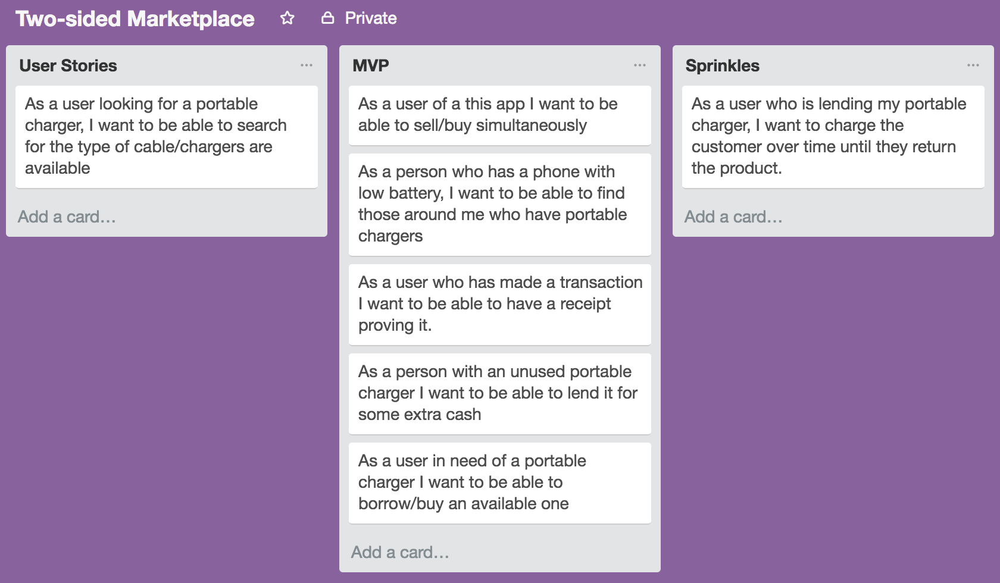
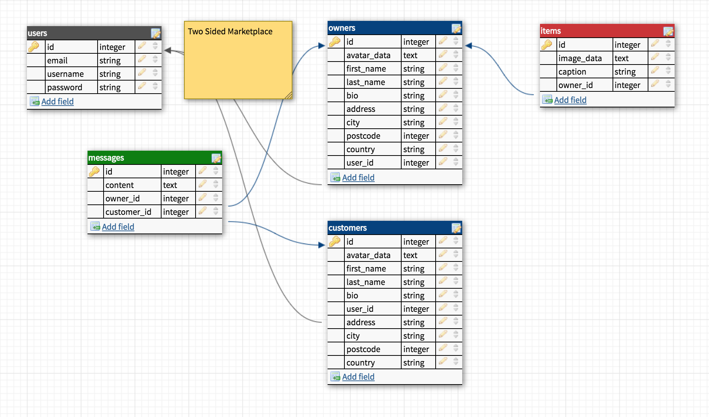
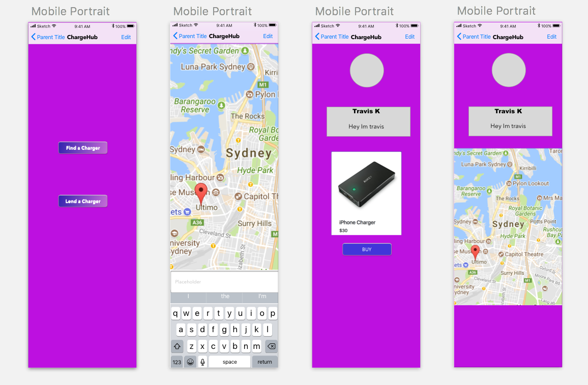

# Term 2 Two Sided Marketplace - PowerBanker
# Travis Kelekolio

## Task
I was tasked to design, build, deploy and present a Ruby on Rails application.
This application is to be a two sided marketplace and cater to two markets that the app brings together.

## Synopsis
My application is a an app for customers to be able to find available power banks/portable chargers nearby through Google Maps API that are owned by other users.

A user can login/sign up to view other users nearby who are willing to lend a portable charger. They then can also search key parameters when browsing for users available. Once a lender, the user can create the item they are lending and display their location where it will be available for nearby customers.

## Configuration and Setup - Rails conventions
I used Robucop as a code analysis tool. and Guard gem with live-reload for speedier refreshing
To add Rubocop gem

```
$ gem install rubocop
```
You can then run
```
$ rubocop --auto-gen-config
```
and this will create .rubocop_todo.yml file which will help you config your robocop.

 then run
```
$ rubocop --config .rubocop_todo.yml
```
and this will run the tests in your todo, they are all defaulted to false, and you can turn them on one by one to allow for easier management of violations.

now make a blank file in your rails base directory
```
$ touch .rubocop.yml
```

Add the line
```
inherit_from: .rubocop_todo.yml
```
to the top of your .rubocop.yml file.


The process is then to run
```
$ rubocop
```
and it will list errors, fix them, then clear that section of rubocop.yml and then enable the next section.
continue until you have none left and integrate this into your regular test suite.

## Ruby gems / APIs used
The following gems were used:
```
# User database
gem 'devise'
# Ignore Keys in .env file
gem 'dotenv-rails', groups: [:development, :test]
# Retrieve user locaion
gem 'geocoder'
# Displaying locations on map
gem 'gmaps4rails'
# Bootstrap scss
gem 'bootstrap', '~> 4.0.0.beta'

gem 'jquery-rails'
# Image uploader
gem 'shrine'
# Cloud for our shrine images(Deployment)
gem 'shrine-cloudinary'
# Payment system
gem 'stripe'
```

now run

```
$ bundle install

```

APIs used:

**Google maps**

**Stripe**

**MailGun**

## Design & Planning
I created the following user stories using Trello.



We used DBdesigner to create the below ERD:



Wireframes of the design are found here:



## Deployment
My web application was deployed using Heroku, and can be found here: http://powerbanker.herokuapp.com/.

## Source Code Management

A ./env was created and ignored to ensure my secret keys were hidden.

## Issues Encountered

### GMaps
The key issue encountered was trying to display Google Maps along with markers which mark the current location of each user nearby. Having to use *Javascript* which I've had no experience with, along with embedded *Ruby*.

I was able to post the current_user location through Javascript and pass it through params, but unfortunately was unable to save it to the database.
```
$.post('/customers/locate',{id: <%= current_user.customer.id %>, lat: position.coords.latitude, lng: position.coords.longitude})
```
As the last resort, I made it so when a User were to create a profile, they were to input their current address. This saves their latitude & longitude values into the database, therefore being able to be displayed on the Map.

### Search
Another issue I encountered was not being able to search the map based on the Lender's item. Instead a user is able to search based on the Lender table.

### Stripe
I also originally wanted to utilise the
payment system of paying over time. As a user is borrowing the item. This may possibly be done through a subscription service, but will be looking into this matter in the future.


## Favorites
My favorite part of building this app was interestingly enough, the biggest challenge. Having to implement a million different ways to retrieve the current_user's current location, I've learnt a lot about using javascript and learning how to pass params correctly. Although in the end, I did not get the result I wanted, I definitely appreciate the knowledge I've gained.
